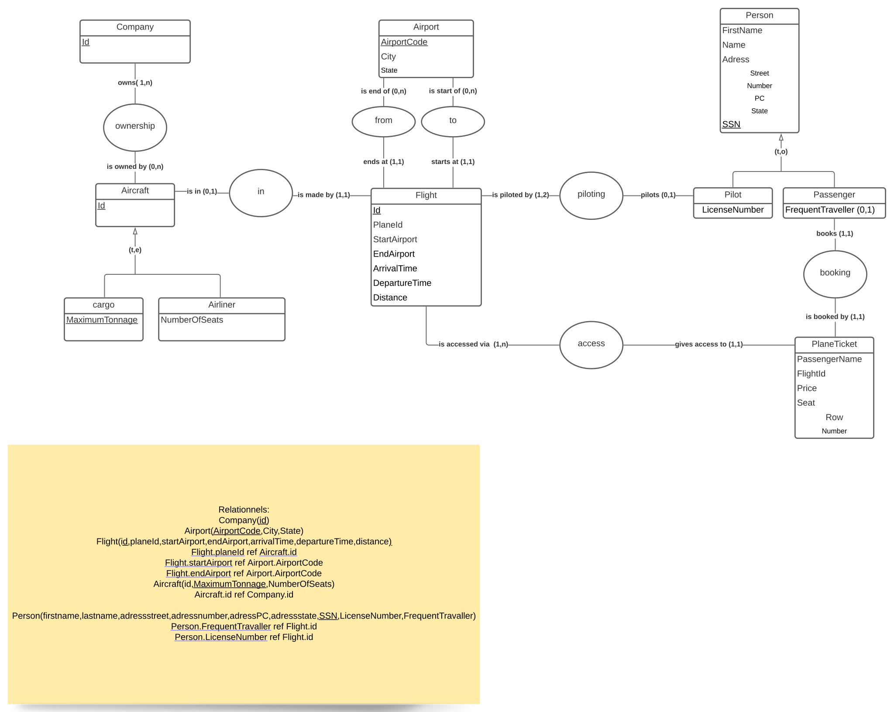
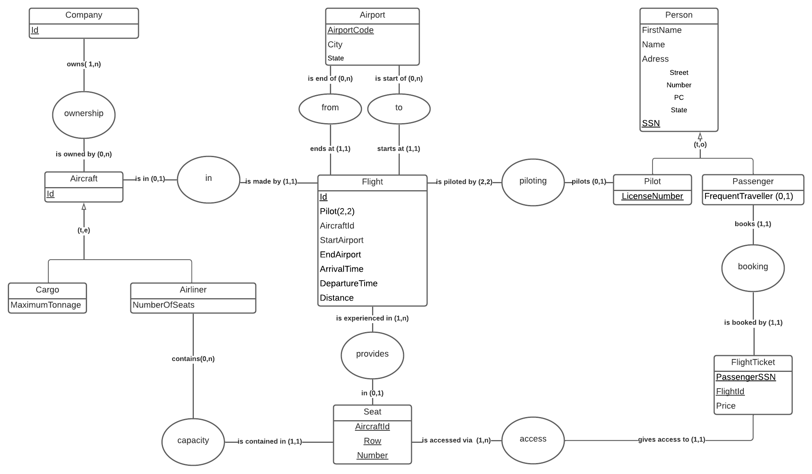
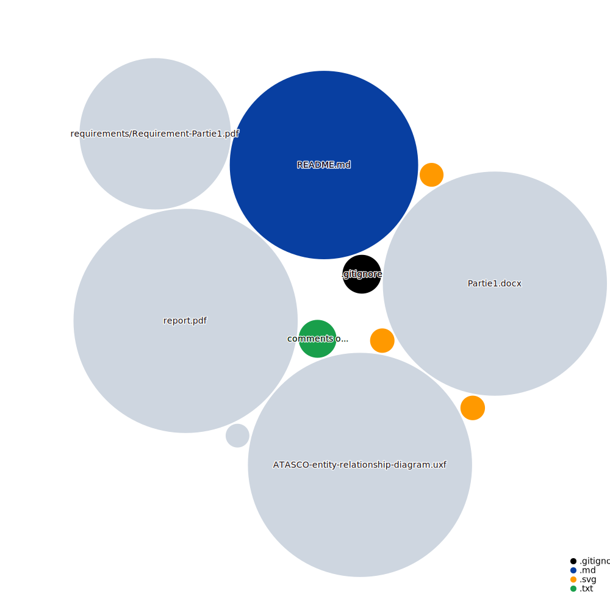

# ATASCO-DB
fictive Air Travel Association for Statistics, Computing and Optimization database

Partie I

Schéma - modèle entité-association

ATASCO-entity-relationship-diagram

L’Air Travel Association for Statistics, Computing and Optimization (ATASCO) a reçu des données de différentes compagnies aériennes US, avec l’objectif d’aider ces compagnies à améliorer leurs offres et réduire leurs coûts.
L’association doit créer une base de données. La 1ère étape consiste à créer un modèle entité-association ainsi qu’un modèle relationnel.
Après plusieurs entretiens avec les compagnies aériennes, le besoin a été défini comme suit :
« Les compagnies disposent de différents types d’avions. 
Les deux principales catégories sont 
les avions de ligne et 
les avions de fret,
mais il en existe d’autres (avions militaires, jets privés, etc.).
Le cœur de l’application consiste à traiter l’information relative aux vols opérés par ces avions.
Les vols consistent tout d’abord à tracer le déplacement des avions d’un aéroport de départ à un aéroport d’arrivée. 

Les compagnies utilisent toutes les informations standards pour représenter les aéroports dans leur jeu de données : 
le code de l’aéroport (ex : ”BWI”) ainsi que 
la ville et 
l’état où celui-ci se trouve. 
Aux aéroports de départ et d’arrivée s’ajoutent 
l’heure de départ, 
l’heure d’arrivée, 
la distance parcourue, 
l’avion qui effectue le vol ainsi qu’
un pilote. 

Les compagnies aériennes disposent également de données relatives à des personnes. Ces personnes sont les 
passagers et les 
pilotes. 
Les passagers sont caractérisés par un 
nom, 
un prénom, 
une adresse (rue, numéro, CP, état) et un 
champ indiquant s’ils sont des voyageurs fréquents. 

Les pilotes sont caractérisés par un 
nom, un 
prénom, une 
adresse (rue, numéro, CP, état) 
un numéro de licence. Notez qu’il est possible que les pilotes voyagent comme passagers sur les vols qu’ils n’assurent pas, par exemple pour rentrer chez eux.

Les avions de ligne disposent d’une capacité fixe exprimée en sièges. Chaque avion dispose d’une certaine 
quantité de ces sièges et chacun de ceux-ci sont attribués à un unique passager sur chaque vol. 

Les sièges sont identifiés par un 
numéro de rangée et 
une lettre, et leur attribution à un passager peut se faire sur réservation moyennant un paiement (dont on souhaite garder une trace du montant). 

Le avions de frets se caractérisent par un tonnage maximum. 
Nous ne disposons d’aucune caractéristique spécifique pour les autres types d’avions, et souhaitons uniquement stocker leurs trajets. 
Il vous incombe de proposer un modèle qui satisfasse à ce besoin. Notez qu’il existe plus d’une solution, l’important étant que votre modèle reprenne un maximum de contraintes d’intégrité et qu’il soit justifié.

***
 
La partie I du projet consiste donc à 
modéliser le problème à l’aide du formalisme entité-association (tel que présenté au cours et au TP) et à 
préciser les contraintes d’intégrité nécessaires. 
Les contraintes additionnelles qui ne se retrouvent pas explicitement sur votre schéma doivent être exprimées en français ou en anglais et utiliser les mêmes noms d’entités, d’associations ou d’attributs que votre modèle conceptuel. 
Vous pouvez également exprimer et justifier des hypothèses complémentaires qui s'appliquent à votre modèle. Ces hypothèses peuvent résulter, par exemple, d’ambiguïtés dans l’énoncé du problème. 
Déduisez ensuite de ce modèle conceptuel le modèle relationnel correspondant ainsi que ses contraintes. Les référencements doivent apparaître explicitement sur votre modèle relationnel (comme au TP) et vos choix de modélisation doivent être justifiés de manière cohérente avec votre modèle entité-association.

Rapport

Pour la première partie, on vous demande de déposer sur l’UV un fichier unique sous format pdf contenant:
1. un diagramme entité-association modélisant le projet ainsi que ses contraintes d'intégrité ;
2. une traduction relationnelle de ce diagramme et ses contraintes d'intégrité ;
3. si besoin: vos hypothèses et la justification de vos choix de modélisation.
Le formalisme utilisé doit être un de ceux vus au cours ou aux TPs.

Informations pratiques

La première partie, en version PDF, devra être rendue sur l’UV pour le mardi 22 mars 2022 à 23h59.
L'ensemble du projet sera à réaliser par groupe de 3 étudiants. Il vous est demandé de vous inscrire sur l'UV dans le groupe de votre choix dès à présent. Vous êtes supposés réaliser l'ensemble du projet au sein du même groupe. Qu'il s'agisse de la partie 1 ou de la partie 2, une seule remise par groupe suffit, pour autant qu'elle reprenne bien le nom de chacun de ses membres. Le respect des échéances est obligatoire.
Pour les étudiants inscrits en INFOH303, le projet, en ce compris la 2ème partie à venir, comptera pour 25% de la note finale du cours. Pour les étudiants en GEOGF4001, uniquement concernés par la partie 1, la note vaudra pour 10% de la note finale de la « partie informatique » du cours. 
Dans tous les cas, il est à noter que le projet ne pouvant pas être représenté en seconde session, sa note est automatiquement reportée dans le calcul final pour le cours lors de la session d'août-septembre. Cette note n’est donc pas modifiable en deuxième session.
Pour les étudiants d'INFOH303, la première partie de votre projet ne fera pas l'objet d'une évaluation systématique mais des questions (par exemple "expliquez vos choix de modélisation") pourront être posées lors de la défense orale finale sur le contenu qui aura été déposé avant le lancement de la deuxième partie.
Toutes les questions au sujet du projet seront abordées UNIQUEMENT pendant les séances de travaux pratiques (pas de mails ou messages sur Teams).

Note

L’énoncé se base sur les données issues de
https://www.transtats.bts.gov/DL_SelectFields.asp?gnoyr_VQ=FIL&QO_fu146_anzr=Nv4%20Pn44vr45

BON TRAVAIL !

