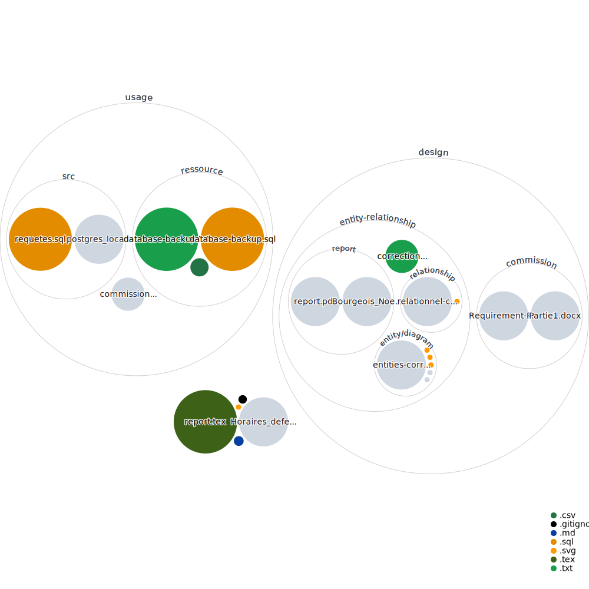

# ATASCO-DB
fictive Air Travel Association for Statistics, Computing and Optimization database

Partie I

Schéma - modèle entité-association

ATASCO-entity-relationship-diagram

Partie II
N.B. : Cette deuxième partie concerne exclusivement les étudiants inscrits au cours
INFOH303. Les consignes ci-dessous s’ajoutent et complètent les consignes données
précédemment dans le cadre de la partie 1, qui restent d’application.
Introduction
Grâce à votre modèle entité-association et votre modèle relationnel, l’équipe
implémentation de l’Air Travel Association for Statistics, Computing and Optimization
(ATASCO) a pu créer une base de données PostgreSQL contenant les données
transmises par les compagnies aériennes. Le schéma de cette base de données
correspond au modèle relationnel finalement arrêté, qui se trouve en pièce jointe
(entities.pdf, relational.pdf). Un backup de cette base de données est également
disponible en pièce jointe (infoh303_202122.sql).
Il vous est maintenant demandé de charger ces données et de réaliser des requêtes.
Installation
Vous pouvez créer la base de données en utilisant le moyen de votre choix (pgadmin.org,
ligne de commande, etc.). L’installation de PostgreSQL et le chargement des données font
partie de l’exercice.
Requêtes
Les requêtes peuvent également être effectuées en utilisant le moyen de votre choix
(pgadmin.org, ligne de commande, etc.) mais doivent impérativement être écrites en SQL.
Vous ne pouvez donc pas utiliser un ORM (Object–relational mapping) qui automatiserait
ces requêtes pour vous.
Proposez le SQL de chaque requête ainsi que si possible, l’algèbre relationnelle et le
calcul relationnel tuple. Dans le cas de l'algèbre relationnelle et du calcul tuple, il se peut
que cela nécessite une syntaxe non vue au cours ou au TP. Dans ce cas, vous n'êtes pas
tenus de les réaliser.
Requête 1
Comptez le nombre de vols effectués par des avions de fret.
Requête 2
Sélectionnez les pilotes qui ont voyagé comme passagers.
Requête 3
Donnez les caractéristiques du vol (identifiant, ville de départ, ville d'arrivée, heure de
départ, heure d'arrivée) ayant compté le plus grand nombre de passagers à ce jour.
Requête 4
Sélectionnez le nom des pilotes n'ayant conduit que des avions de ligne dans la base de
données.
Requête 5
Les compagnies aériennes doivent avoir accès à des statistiques de base. Pour chacune
des compagnies suivantes, 'ABX Air Inc', 'ADVANCED AIR, LLC', il vous est demandé de
sélectionner, pour chaque jour, la distance moyenne parcourue par ses avions.
Requête 6
Afin d’améliorer leurs offres pour le voyageurs business, l’association souhaite que vous
sélectionniez les destinations où l'aller-retour est possible en un jour. 
Un aller-retour est considéré possible en un jour si le vol aller décolle après 7 heures du
matin, que le vol de retour décolle le même jour que le vol aller et qu’il s’écoule au
minimum 7 heures entre l'atterrissage et le décollage du retour (sans quoi le voyageur
n’aurait pas le temps pour ses réunions). Attention : seuls les vols de ligne rentrent en
ligne de compte pour le calcul.
Requête 7
Afin d’éviter le gaspillage des ressources, il vous est demandé de sélectionner les vols
comptant moins de 20 passagers et de calculer, par compagnie, la moyenne des sièges
occupée sur ces vols. Ordonnez les résultats par moyenne croissante.
Requête 8
Afin de s’assurer que les pilotes ne travaillent pas trop de jours d’affilé, comptez le
maximum de jours consécutifs qu'un pilote a volé. Attention: la date peut changer entre
l'heure de décollage et l'heure d'atterrissage et il faut tenir compte de cette possibilité.
Ordonnez les résultats en commençant par les pilotes ayant volé le plus de jours
consécutifs.
Requête 9
Le fichier csv_file.csv contient l’Id de certains pilotes que l’ATASCO va nommer comme
experts internes en 2022. On vous demande de charger ce fichier dans une base de
données en utilisant des requêtes SQL. La nouvelle table à créer doit contenir trois
colonnes : une clé primaire piloteId référençant l’id du pilote, une date et un champ
booléen « nouveau » qui indique si le pilote a déjà servi comme expert ou non. Le csv
contient deux colonnes : une colonne de texte contenant la chaîne de caractère « existingexpert-- » + id ou « new-expert » + id, et la date du début de sa nomination.
Requête 10
Pour finir, l’association souhaite créer des groupes de discussion permettant aux aéroports
d’échanger sur différents sujets: mobilité, économie, écologie, etc. L’idée est que
l’association crée ces différents groupes et permette aux différents aéroports de s’inscrire
pour les sujets auxquels ils souhaitent participer. Écrivez le DDL nécessaire à la création
des tables requises, et créez-les dans votre base de données. Insérez au minimum un
aéroport pour chacun des 3 sujets énoncés ci-dessus. 
***
Ces requêtes sont en très grande partie réalisables sur la base de ce qui a été vu au
cours. Quelques méthodes non vues peuvent toutefois vous aider : 
- le casting (https://www.postgresql.org/docs/14/sql-expressions.html#SQL-SYNTAXTYPE-CASTS) permet de convertir le type d’une donnée. Un timestamp peut par exemple
être converti en date en utilisant NomDeLaColonneContenantLeTimestamp::date dans
votre requête ;
- la opérations sur les Date/Time sont très importantes et peuvent être trouvées ici :
https://www.postgresql.org/docs/14/functions-datetime.html ;
- la requête 8 peut être réalisée au moyen d’une window function
(https://www.postgresql.org/docs/14/tutorial-window.html) et des fonctions associées
(https://www.postgresql.org/docs/14/functions-window.html);
- pour la requête 9, nous vous conseillons d’utiliser une table temporaire
(https://www.postgresql.org/docs/14/sql-createtable.html) pour charger les données. Vous
pouvez éclater une chaîne de caractère en utilisant la fonction split_part
(https://www.postgresql.org/docs/14/functions-string.html). Vous pouvez vérifier si une
chaîne de caractères en contient une autre en utilisant des expressions expression
régulières ou du pattern matching (https://www.postgresql.org/docs/14/functionsmatching.html#FUNCTIONS-POSIX-REGEXP). Enfin, Postgres permet des expression
conditionnelles (https://www.postgresql.org/docs/14/functions-conditional.html). 
Rapport
Pour la deuxième partie, on vous demande de déposer sur l’UV un fichier unique sous
format pdf contenant:
1. un corrigé de votre modèle entité-association et votre modèle relationnel : en vous 
référent au corrigé, relevez les améliorations possibles de votre modèle et 
expliquez-les. Si vos choix vous semblent justes mais différents de ceux du corrigé,
défendez-les.
2. vos requêtes (1 par page) écrites en SQL et, si possible avec la syntaxe vue au 
cours ou au TP, en algèbre relationnelle et en calcul tuple.
Informations pratiques
La deuxième partie, en version PDF, devra être rendue sur l’UV pour le 15 mai à 23h59.
La remise du projet dans les délais est obligatoire (une copie par groupe suffit) et aucun
retard ne sera accepté pour la remise des documents du projet. Il n'est pas possible de
changer les groupe entre la partie 1 et 2.
Après le dépôt sur l'UV des documents demandés ci-dessus, la défense du projet aura
lieu dans les jours qui suivent selon un horaire à déterminer. Au sein du groupe, chacun
d'entre vous devra être capable de présenter et de justifier vos choix de modélisation ainsi
que vos requêtes. Sur base de notre évaluation des acquis au sein de la défense, il se
peut que nous n'attribuions pas la même note à chaque membre du groupe.
Vous pouvez développer sur votre propre machine et présenter vos projets sur un
ordinateur portable que vous apporterez lors de la défense.
Objectifs évalués lors de la défense orale du projet
Pour les étudiants inscrits en INFOH303, la note finale de votre projet sera calculée sur un
total de 10 points répartis entre les objectifs suivants. En particulier, vous devez être
capables de :
 Discuter et défendre votre modèle entité-association et sa traduction relationnelle et
les comparer par rapport à la solution donnée en justifiant vos choix de modélisation.
(3 points)
 Expliquer l’écriture de vos requêtes (algèbre, calcul relationnel tuple et SQL) au
moment de la défense. Attention, il s'agit d'une évaluation orale qui ne porte que sur
les requêtes que les évaluateurs vous demanderont de présenter. Faute de temps,
l’ensemble des requêtes que vous aurez préparées ne sera pas systématiquement
évalué. Lors de la défense vous devez aussi apporter votre base de données et
pouvoir y exécuter des requêtes. Par exemple, en plus des requêtes demandées dans
le présent énoncé, les évaluateurs pourront vous demander d'exécuter une ou
plusieurs requêtes dont ils vous fourniront la syntaxe SQL au moment même de la
défense. (5 points)
 Réaliser une présentation de bonne qualité faisant montre d’une bonne maîtrise
transversale de la matière. (2 points)
Nota Bene :
1. Toutes les questions au sujet du projet seront abordées UNIQUEMENT pendant
les séances de travaux pratiques (pas de mails ou messages sur Teams).
2. L'utilisation d'SQLite n'est pas autorisée dans le cadre du projet
3. Les données sont issues de https://www.transtats.bts.gov/DL_SelectFields.asp?
gnoyr_VQ=FIL&QO_fu146_anzr=Nv4%20Pn44vr45 et ont été enrichies de
données fictives complémentaires à des fins d’exercice.
------------------------------------------------------------------------------------------------------------------------------------------

ATASCO-entity-relationship-diagram            |  correction
:-------------------------:|:-------------------------:

  | ./design/entity-relationship/entity/diagram/entities-correction-proposition.svg)
  
  
L’Air Travel Association for Statistics, Computing and Optimization (ATASCO) a reçu des données de différentes compagnies aériennes US, avec l’objectif d’aider ces compagnies à améliorer leurs offres et réduire leurs coûts.
L’association doit créer une base de données. La 1ère étape consiste à créer un modèle entité-association ainsi qu’un modèle relationnel.
Après plusieurs entretiens avec les compagnies aériennes, le besoin a été défini comme suit :
« Les compagnies disposent de différents types d’avions. 
Les deux principales catégories sont 
les avions de ligne et 
les avions de fret,
mais il en existe d’autres (avions militaires, jets privés, etc.).
Le cœur de l’application consiste à traiter l’information relative aux vols opérés par ces avions.
Les vols consistent tout d’abord à tracer le déplacement des avions d’un aéroport de départ à un aéroport d’arrivée. 

Les compagnies utilisent toutes les informations standards pour représenter les aéroports dans leur jeu de données : 
le code de l’aéroport (ex : ”BWI”) ainsi que 
la ville et 
l’état où celui-ci se trouve. 
Aux aéroports de départ et d’arrivée s’ajoutent 
l’heure de départ, 
l’heure d’arrivée, 
la distance parcourue, 
l’avion qui effectue le vol ainsi qu’
un pilote. 

Les compagnies aériennes disposent également de données relatives à des personnes. Ces personnes sont les 
passagers et les 
pilotes. 
Les passagers sont caractérisés par un 
nom, 
un prénom, 
une adresse (rue, numéro, CP, état) et un 
champ indiquant s’ils sont des voyageurs fréquents. 

Les pilotes sont caractérisés par un 
nom, un 
prénom, une 
adresse (rue, numéro, CP, état) 
un numéro de licence. Notez qu’il est possible que les pilotes voyagent comme passagers sur les vols qu’ils n’assurent pas, par exemple pour rentrer chez eux.

Les avions de ligne disposent d’une capacité fixe exprimée en sièges. Chaque avion dispose d’une certaine 
quantité de ces sièges et chacun de ceux-ci sont attribués à un unique passager sur chaque vol. 

Les sièges sont identifiés par un 
numéro de rangée et 
une lettre, et leur attribution à un passager peut se faire sur réservation moyennant un paiement (dont on souhaite garder une trace du montant). 

Le avions de frets se caractérisent par un tonnage maximum. 
Nous ne disposons d’aucune caractéristique spécifique pour les autres types d’avions, et souhaitons uniquement stocker leurs trajets. 
Il vous incombe de proposer un modèle qui satisfasse à ce besoin. Notez qu’il existe plus d’une solution, l’important étant que votre modèle reprenne un maximum de contraintes d’intégrité et qu’il soit justifié.

***
 
La partie I du projet consiste donc à 
modéliser le problème à l’aide du formalisme entité-association (tel que présenté au cours et au TP) et à 
préciser les contraintes d’intégrité nécessaires. 
Les contraintes additionnelles qui ne se retrouvent pas explicitement sur votre schéma doivent être exprimées en français ou en anglais et utiliser les mêmes noms d’entités, d’associations ou d’attributs que votre modèle conceptuel. 
Vous pouvez également exprimer et justifier des hypothèses complémentaires qui s'appliquent à votre modèle. Ces hypothèses peuvent résulter, par exemple, d’ambiguïtés dans l’énoncé du problème. 
Déduisez ensuite de ce modèle conceptuel le modèle relationnel correspondant ainsi que ses contraintes. Les référencements doivent apparaître explicitement sur votre modèle relationnel (comme au TP) et vos choix de modélisation doivent être justifiés de manière cohérente avec votre modèle entité-association.

Rapport

Pour la première partie, on vous demande de déposer sur l’UV un fichier unique sous format pdf contenant:
1. un diagramme entité-association modélisant le projet ainsi que ses contraintes d'intégrité ;
2. une traduction relationnelle de ce diagramme et ses contraintes d'intégrité ;
3. si besoin: vos hypothèses et la justification de vos choix de modélisation.
Le formalisme utilisé doit être un de ceux vus au cours ou aux TPs.

Informations pratiques

La première partie, en version PDF, devra être rendue sur l’UV pour le mardi 22 mars 2022 à 23h59.
L'ensemble du projet sera à réaliser par groupe de 3 étudiants. Il vous est demandé de vous inscrire sur l'UV dans le groupe de votre choix dès à présent. Vous êtes supposés réaliser l'ensemble du projet au sein du même groupe. Qu'il s'agisse de la partie 1 ou de la partie 2, une seule remise par groupe suffit, pour autant qu'elle reprenne bien le nom de chacun de ses membres. Le respect des échéances est obligatoire.
Pour les étudiants inscrits en INFOH303, le projet, en ce compris la 2ème partie à venir, comptera pour 25% de la note finale du cours. Pour les étudiants en GEOGF4001, uniquement concernés par la partie 1, la note vaudra pour 10% de la note finale de la « partie informatique » du cours. 
Dans tous les cas, il est à noter que le projet ne pouvant pas être représenté en seconde session, sa note est automatiquement reportée dans le calcul final pour le cours lors de la session d'août-septembre. Cette note n’est donc pas modifiable en deuxième session.
Pour les étudiants d'INFOH303, la première partie de votre projet ne fera pas l'objet d'une évaluation systématique mais des questions (par exemple "expliquez vos choix de modélisation") pourront être posées lors de la défense orale finale sur le contenu qui aura été déposé avant le lancement de la deuxième partie.
Toutes les questions au sujet du projet seront abordées UNIQUEMENT pendant les séances de travaux pratiques (pas de mails ou messages sur Teams).

Note

L’énoncé se base sur les données issues de
https://www.transtats.bts.gov/DL_SelectFields.asp?gnoyr_VQ=FIL&QO_fu146_anzr=Nv4%20Pn44vr45

BON TRAVAIL !

